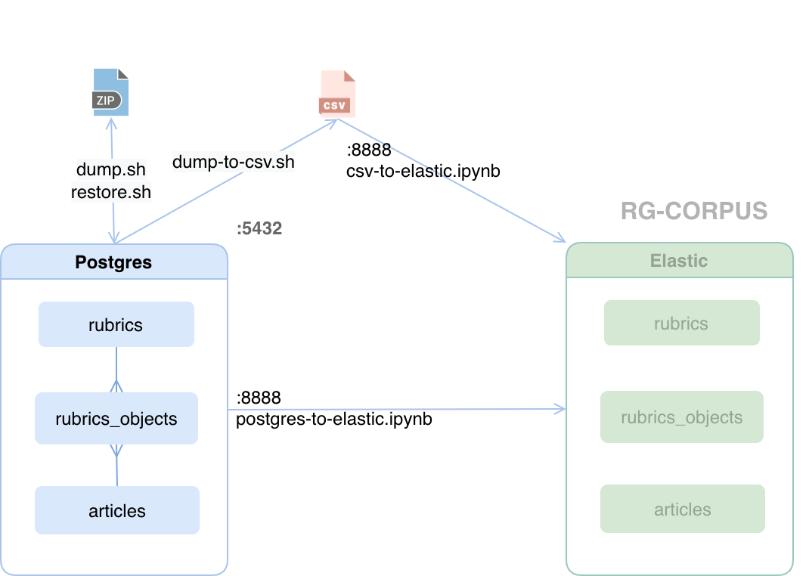

RG-DB
========

**База данных Postgresql**, в рамках построения рекомендательной системы RGRU.



Основное хранилище данных закачанных из API RG. Наполнение данными - проект [api-rg-data-migration](https://git.rgwork.ru/masterback/api-rg-data-migration).
Обработка данных – проект [text-processor](https://git.rgwork.ru/masterback/text-processor).
Для экспорта данных в  Эластик используйте 
<a href="http://dockertest.rgwork.ru:8888/notebooks/postgres-to-elastic.ipynb">postgres-to-elastic.ipynb</a>


<a target="_blank" href="https://viewer.diagrams.net/?highlight=0000ff&edit=_blank&layers=1&nav=1&title=RG%20NLP%20project.drawio#Uhttps%3A%2F%2Fdrive.google.com%2Fuc%3Fid%3D1yflDpag5TSUrKPRsHgFzR2sBhjBY_7tz%26export%3Ddownload">Общая схема проектов</a>


## Настройки сервера

**1. Тома (volumes)**

Для наполнения БД данными RG API может потребоваться 
несколько суток. Чтобы сократить время создайте внешние тома
для данных и дампов  
```
$ docker volume create rg-db-data
$ docker volume create rg-db-data-dumps
```


**2. Переменная окружения RGPASS**

Определите переменную RGPASS c паролем суперпользователя postgress.(r********1)
```
$ export RGPASS=r******1
```

## Дамп 
Дампы базы данных хранятся в директории ../rgdb-dumps/rg-db.
Чтобы создать дамп выполните команду (2.5 мин на dockertest.rgwork.ru)

```
sh/dump.sh
```
## Восстановление данных
Для восстановления данных из дампа выполните команду (8 мин на dockertest.rgwork.ru)
```
sh/restore.sh ../rgdb-dumps/rg-db/rgdb....dump.gz
```

## Настройки сronjob

На сервере настроен дамп базы данных rgdb каждое воскресенье в 00:00.
```
0 0 * * 0 /home/gitupdater/rg-db-prod/sh/dump.sh
```
Просмотр расписания
```
crontab -l
```
Редактирование
```
crontab -e
```
## Экспорт данных в Эластик
Проводится в два этапа. 

1. Экспорт в csv (3 мин)
    ```
    sh/dump-to-csv.sh
    ```
    CSV файлы сохраняются в директорию csv/

2. Импрорт csv в Эластик (30 мин)
   
   Откройте браузер
    <http://dockertest.rgwork.ru:8888/notebooks/csv-to-elastic.ipynb>. 
    Введите пароль. Запустите программу. 
    После импорта файлы csv можно удалить.

<br><br>
Дополнительная информация в notes.md.

...
...